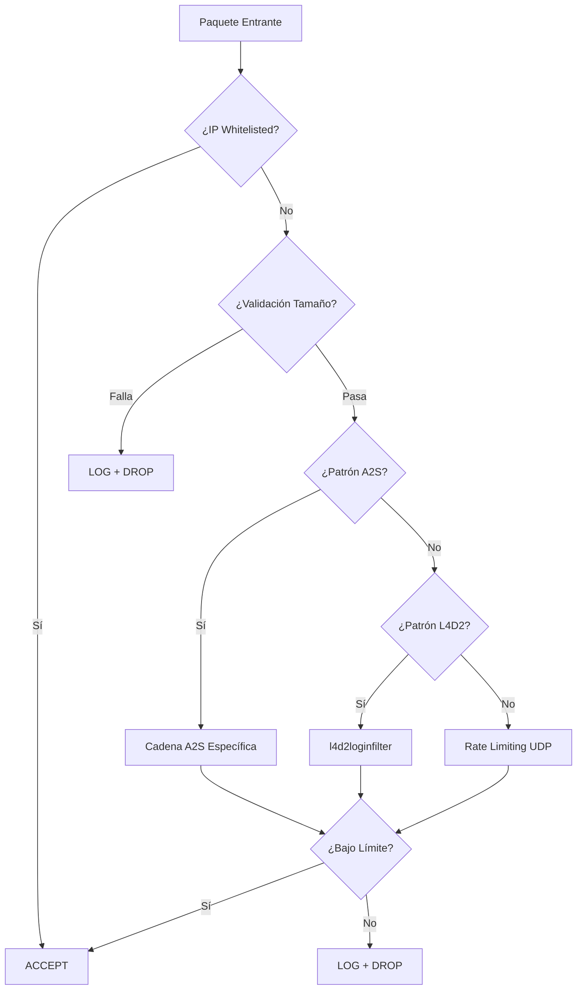

# iptables.rules.sh - Motor de Protección Principal

## Tabla de Contenidos

- [Descripción General](#descripción-general)
- [Instalación y Configuración](#instalación-y-configuración)
- [Arquitectura del Sistema](#arquitectura-del-sistema)
- [Detección y Mitigación de Ataques](#detección-y-mitigación-de-ataques)
- [Algoritmos de Rate Limiting](#algoritmos-de-rate-limiting)
- [Configuración Avanzada](#configuración-avanzada)
- [Análisis de Performance](#análisis-de-performance)
- [Troubleshooting](#troubleshooting)

## Descripción General

`iptables.rules.sh` es el núcleo de la suite L4D2 IPTables, implementando un sistema avanzado de protección contra ataques DDoS específicamente diseñado para servidores Source Engine. Utiliza técnicas sofisticadas de detección basadas en patrones de paquetes, validación de contenido y algoritmos de rate limiting para mitigar múltiples tipos de ataques.

### Características Técnicas Principales

- **Detección por Patrones Hexadecimales**: Identificación de comandos específicos del protocolo Source Engine
- **Validación de Tamaño de Paquetes**: Filtrado basado en longitudes conocidas de ataques
- **Rate Limiting Avanzado**: Algoritmos hashlimit con múltiples modalidades
- **Separación Funcional**: Diferenciación entre GameServer y SourceTV
- **Soporte Multi-Cadena**: Protección simultánea INPUT y DOCKER
- **Logging Categorizado**: Sistema de logs con prefijos específicos por tipo de ataque

## Instalación y Configuración

### Requisitos del Sistema

- **Sistema Operativo**: Linux con iptables 1.6.0+ (soporte para hashlimit y string matching)
- **Permisos**: Acceso root/sudo
- **Dependencias**: dig (dnsutils), iptables-persistent (recomendado)
- **Memoria**: Mínimo 256MB RAM libre para tablas hash de iptables

### Instalación

```bash
# Descargar la suite completa
git clone https://github.com/AoC-Gamers/L4D2-Iptable-Suite.git
cd L4D2-Iptable-Suite

# Verificar dependencias
which iptables dig
iptables --version

# Configurar archivo de entorno
cp example.env .env
nano .env  # Personalizar según tu configuración
```

### Configuración Básica

El script utiliza variables de entorno definidas en `.env`:

```bash
# === CONFIGURACIÓN FUNDAMENTAL ===
TYPECHAIN=0                     # 0=INPUT, 1=DOCKER, 2=AMBOS
GAMESERVERPORTS="27015"         # Puertos del servidor de juego
TVSERVERPORTS="27020"           # Puertos de SourceTV
CMD_LIMIT=100                   # Tickrate base para cálculos

# === PROTECCIÓN TCP ===
ENABLE_TCP_PROTECT=true         # Activar bloqueo TCP completo
TCP_PROTECTION=""               # Puertos específicos (vacío = todos)

# === ACCESO ADMINISTRATIVO ===
SSH_PORT="22"                   # Puertos SSH del sistema
WHITELISTED_IPS=""              # IPs completamente confiables

# === LOGGING DETALLADO ===
LOG_PREFIX_INVALID_SIZE="INVALID_SIZE: "
LOG_PREFIX_MALFORMED="MALFORMED: "
LOG_PREFIX_A2S_INFO="A2S_INFO_FLOOD: "
# ... [12 prefijos más para categorización]
```

### Ejecución

```bash
# Aplicar reglas (reemplaza configuración anterior)
sudo ./iptables.rules.sh

# Verificar reglas aplicadas
sudo iptables -L -n -v --line-numbers

# Hacer reglas persistentes
sudo ./ipp.sh  # Opciones 1 y 5
```

## Arquitectura del Sistema

### Cadenas Personalizadas Creadas

El script crea múltiples cadenas especializadas para organizar la lógica de filtrado:

```bash
# Cadenas de Rate Limiting UDP
UDP_GAME_NEW_LIMIT           # Nuevas conexiones UDP (1er nivel)
UDP_GAME_NEW_LIMIT_GLOBAL    # Nuevas conexiones UDP (2do nivel - global)
UDP_GAME_ESTABLISHED_LIMIT   # Conexiones UDP establecidas

# Cadenas de Consultas A2S
A2S_LIMITS                   # A2S_INFO queries (0x54)
A2S_PLAYERS_LIMITS          # A2S_PLAYERS queries (0x55)  
A2S_RULES_LIMITS            # A2S_RULES queries (0x56)
STEAM_GROUP_LIMITS          # Steam Group queries (0x00)

# Cadenas Especializadas
l4d2loginfilter             # Filtro de conexiones L4D2
TCPfilter                   # Filtro TCP general (cuando aplica)
DOCKER                      # Cadena para contenedores (cuando aplica)
```

### Flujo de Procesamiento



## Detección y Mitigación de Ataques

### Mecanismo de Detección de Paquetes a Nivel Kernel

Antes de aplicar cualquier filtro específico (longitud, patrón o rate limit), Netfilter intercepta los paquetes en distintos hook points del kernel:

#### **Hook Points del Sistema**
1. **Hook Point**: Los paquetes entrantes activan `NF_INET_PRE_ROUTING` (para NAT) y luego `NF_INET_LOCAL_IN` (para reglas de filter/INPUT)

2. **Selección de Tabla y Cadena**: Se usa la tabla `filter`, cadena `INPUT` (o `DOCKER` según `TYPECHAIN`)

3. **Iteración de Reglas**: Netfilter recorre cada regla en orden secuencial:
   - **Carga**: `struct ipt_entry` para cada regla
   - **Match Length** (`xt_length`): Verifica `skb->len` contra el rango configurado
   - **Match String** (`xt_string`): Ejecuta algoritmo Boyer–Moore sobre `skb->data`, buscando firmas hexadecimales (ej: `0xFF 0xFF 0xFF 0xFF 0x54`)
   - **Match Hashlimit** (`xt_hashlimit`): Hash lookup basado en clave (modo `srcip/dstport`), verifica tokens en token bucket, actualiza contadores

4. **Decisión**: Si match falla → siguiente regla; si coincide → aplica acción (`ACCEPT/DROP`)

5. **DROP por Defecto**: Política `-P INPUT DROP` descarta paquetes no coincidentes

#### **Optimización del Flujo**
- **Reglas rápidas primero**: Whitelist y validación de longitud (`O(1)` checks)
- **Pattern matching**: `O(M)` por longitud de patrón, donde M=5 bytes para A2S
- **Hashlimit**: `O(1)` lookup + gestión de tokens
- **Implementación en C**: Módulos kernel (`xt_length`, `xt_string`, `xt_hashlimit`) minimizan sobrecarga

### 1. Ataques de Validación de Paquetes {#ataques-validacion-paquetes}

Los ataques de validación de paquetes explotan debilidades en el procesamiento de paquetes UDP con tamaños específicos o estructuras malformadas. Estos ataques pueden causar desde consumo excesivo de CPU hasta crashes del servidor mediante buffer overflows o saturación de recursos.

#### 1.1. Validación de Tamaño de Paquetes

#### Detección de Paquetes Inválidos

**Algoritmo de Detección**:
```bash
# Paquetes demasiado pequeños (0-28 bytes)
iptables -A INPUT -p udp --dports $GAMESERVERPORTS \
    -m length --length 0:28 \
    -m limit --limit 60/min \
    -j LOG --log-prefix "INVALID_SIZE: "

# Paquetes demasiado grandes (2521+ bytes)  
iptables -A INPUT -p udp --dports $GAMESERVERPORTS \
    -m length --length 2521:65535 \
    -m limit --limit 60/min \
    -j LOG --log-prefix "INVALID_SIZE: "
```

**Fundamentos Técnicos**:
- **0-28 bytes**: Insuficiente para comandos válidos Source Engine
- **2521+ bytes**: Excede MTU estándar, probable fragmentación maliciosa
- **Rate limiting**: Máximo 60 logs/minuto para evitar spam de logs

#### Detección de Paquetes Malformados

**Tamaños Específicos de Ataques Conocidos**:
```bash
# 30-32 bytes: Exploit específico de buffer overflow
iptables -A INPUT -p udp --dports $GAMESERVERPORTS \
    -m length --length 30:32 \
    -j LOG --log-prefix "MALFORMED: " && DROP

# 46 bytes: Attack vector conocido para crash de servidor
iptables -A INPUT -p udp --dports $GAMESERVERPORTS \
    -m length --length 46:46 \
    -j LOG --log-prefix "MALFORMED: " && DROP

# 60 bytes: Patrón de ataque de saturación específico
iptables -A INPUT -p udp --dports $GAMESERVERPORTS \
    -m length --length 60:60 \
    -j LOG --log-prefix "MALFORMED: " && DROP
```

**Justificación**:
- Estos tamaños corresponden a exploits documentados en la comunidad Source Engine
- No son utilizados por clientes legítimos en operación normal
- Su bloqueo no afecta la funcionalidad del servidor

### 2. Ataques de Consulta A2S (Server Query Protocol) {#ataques-consulta-a2s}

Los ataques A2S explotan el protocolo de consulta de servidores Source Engine para saturar el ancho de banda y CPU del servidor. Cada tipo de consulta A2S tiene un impacto diferente según el tamaño de la respuesta que genera el servidor, siendo A2S_RULES el más peligroso por sus respuestas masivas.

#### **Mecanismo de Detección de Consultas A2S a Nivel Kernel**

Antes de las reglas específicas de cada tipo de consulta, Netfilter realiza un proceso de detección optimizado:

##### **1. Encaminamiento a Cadena A2S**
```bash
iptables -A INPUT -p udp --dports $GAMESERVERPORTS \
    -m string --algo bm --hex-string '|FFFFFFFF..|' -j <Cadena_A2S>
```
- Cualquier paquete UDP al puerto de juego que contenga el prefijo `0xFF FF FF FF` se redirige a la cadena correspondiente (`A2S_LIMITS`, `A2S_PLAYERS_LIMITS`, etc.)

##### **2. Match de Firma con Boyer–Moore (`xt_string`)**
- **Algoritmo**: Boyer–Moore para búsqueda en `skb->data`
- **Patrón**: 4 bytes header (`0xFF 0xFF 0xFF 0xFF`) + 1 byte comando (`0x54`, `0x55`, `0x56`, `0x00`)
- **Complejidad**: `O(M+N)` en tiempo de kernel:
  - `M` = longitud del patrón (5 bytes)
  - `N` = tamaño del payload examinado (limitado al inicio del paquete)
- **Decisión**: Si coincide → entra en cadena A2S; si no → continúa evaluación en INPUT/DOCKER

##### **3. Rate Limiting por Consulta (`xt_hashlimit`)**
```bash
iptables -A <Cadena_A2S> \
    -m hashlimit --hashlimit-upto X/sec \
    --hashlimit-burst Y \
    --hashlimit-mode <modo> \
    --hashlimit-name <Name> \
    --hashlimit-htable-expire Z \
    -j ACCEPT
iptables -A <Cadena_A2S> -j DROP
```

**Proceso interno**:
- **Hash Lookup**: Calcula hash de la clave (modo `srcip`, `dstport` o `srcip,dstport`) para indexar `/proc/net/ipt_hashlimit/<Name>`
- **Token Bucket**: Cada entrada almacena tokens (inicial = `burst`):
  - Por cada paquete: intenta consumir 1 token
  - Si hay tokens: `ACCEPT` + recarga a ritmo `X/sec` (máximo = `burst`)
  - Si bucket vacío: `DROP` (flood detectado)
- **Expire**: Entradas eliminadas tras `Z ms` sin actividad (control de memoria)

##### **4. Garantías del Sistema**
- Solo paquetes con firma exacta de cada consulta A2S son sometidos a limitación
- Exceso de frecuencia bloqueado automáticamente antes de afectar al servidor
- Tráfico legítimo preservado dentro de los límites configurados

#### 2.1. Detección de Consultas A2S (Server Query Protocol)

#### A2S_INFO (0x54) - Flood de Información Básica

**Patrón Hexadecimal**:
```bash
# Detección por signature hexadecimal
iptables -A INPUT -p udp --dports $GAMESERVERPORTS \
    -m string --algo bm --hex-string '|FFFFFFFF54|' \
    -j A2S_LIMITS
```

**Análisis del Patrón**:
- `FFFFFFFF`: Header estándar Source Engine (4 bytes 0xFF)
- `54`: Comando A2S_INFO en hexadecimal
- Solicita: nombre servidor, mapa, jugadores, máximo jugadores, etc.

**Rate Limiting Aplicado**:
```bash
iptables -A A2S_LIMITS \
    -m hashlimit --hashlimit-upto 8/sec \
    --hashlimit-burst 30 \
    --hashlimit-mode dstport \
    --hashlimit-name A2SFilter \
    --hashlimit-htable-expire 5000 \
    -j ACCEPT
```

**Parámetros Técnicos**:
- **8/sec**: Máximo 8 consultas por segundo (normal: 1-2/sec)
- **burst 30**: Permite ráfagas iniciales de hasta 30 consultas
- **modo dstport**: Rate limiting por puerto de destino (protege todos los IPs)
- **expire 5000ms**: Ventana de seguimiento de 5 segundos

#### A2S_PLAYERS (0x55) - Flood de Lista de Jugadores

**Detección**:
```bash
iptables -A INPUT -p udp --dports $GAMESERVERPORTS \
    -m string --algo bm --hex-string '|FFFFFFFF55|' \
    -j A2S_PLAYERS_LIMITS
```

**Características del Ataque**:
- **Impacto Mayor**: Respuesta más grande que A2S_INFO
- **CPU Intensivo**: Servidor debe procesar lista de jugadores activos
- **Bandwidth**: Consume más ancho de banda por respuesta

**Mitigación Idéntica**: Mismos parámetros que A2S_INFO pero en cadena separada para logging diferenciado.

#### A2S_RULES (0x56) - Flood de Variables del Servidor

**Detección**:
```bash
iptables -A INPUT -p udp --dports $GAMESERVERPORTS \
    -m string --algo bm --hex-string '|FFFFFFFF56|' \
    -j A2S_RULES_LIMITS
```

**Severidad Alta**:
- **Respuesta Masiva**: Puede incluir cientos de variables del servidor
- **Mayor Impacto**: Potencialmente 10-50x más datos que A2S_INFO
- **Vulnerabilidad Crítica**: Método preferido para saturación de bandwidth

#### Steam Group Queries (0x00)

**Detección**:
```bash
iptables -A INPUT -p udp --dports $GAMESERVERPORTS \
    -m string --algo bm --hex-string '|FFFFFFFF00|' \
    -j STEAM_GROUP_LIMITS
```

**Rate Limiting Más Estricto**:
```bash
iptables -A STEAM_GROUP_LIMITS \
    -m hashlimit --hashlimit-upto 1/sec \  # Más restrictivo: 1/sec
    --hashlimit-burst 3 \                  # Burst menor: 3
    --hashlimit-mode srcip,dstport \       # Por IP+puerto
    -j ACCEPT
```

**Justificación**:
- Consultas menos frecuentes en uso normal
- Potencial para abuso con grupos grandes
- Rate limiting por IP individual más restrictivo

### 3. Ataques Específicos de L4D2 {#ataques-especificos-l4d2}

Los ataques específicos de L4D2 se dirigen a las funcionalidades únicas del juego, como el sistema de conexión de jugadores y la reserva de slots. Estos ataques pueden interrumpir la experiencia de juego al prevenir conexiones legítimas o desestabilizar el sistema de matchmaking.

#### 3.1. Protección Específica L4D2

#### L4D2 Connect/Reserve Flood

**Filtro Especializado**:
```bash
# l4d2loginfilter - Cadena personalizada para conexiones L4D2
iptables -A l4d2loginfilter \
    -m hashlimit --hashlimit-upto 1/sec \
    --hashlimit-burst 1 \
    --hashlimit-mode srcip,dstip,dstport \
    --hashlimit-name L4D2CONNECTPROTECT \
    --hashlimit-htable-expire 1000 \
    --hashlimit-htable-max 1048576 \
    -m string --algo bm --string "connect" \
    -j ACCEPT

iptables -A l4d2loginfilter \
    -m hashlimit --hashlimit-upto 1/sec \
    --hashlimit-burst 1 \
    --hashlimit-mode srcip,dstip,dstport \
    --hashlimit-name L4D2RESERVEPROTECT \
    --hashlimit-htable-expire 1000 \
    --hashlimit-htable-max 1048576 \
    -m string --algo bm --string "reserve" \
    -j ACCEPT

# Todo lo que no coincida con "connect" o "reserve" se bloquea
iptables -A l4d2loginfilter -j DROP
```

**Activación del Filtro**:
```bash
# Se activa con patrón específico + rango de tamaño
iptables -A INPUT -p udp --dports $GAMESERVERPORTS \
    -m length --length 1:70 \
    -m string --algo bm --hex-string '|FFFFFFFF71|' \
    -j l4d2loginfilter
```

**Análisis Técnico**:
- **Patrón 0x71**: Identificador específico de paquetes de conexión L4D2
- **Longitud 1:70**: Rango típico de paquetes de conexión legítimos
- **String matching**: Búsqueda de literales "connect" y "reserve"
- **Ultra-restrictivo**: 1 paquete/segundo, burst 1

**Protección Contra**:
- **Connection Flood**: Spam masivo de intentos de conexión
- **Reserve Slot Abuse**: Abuso del sistema de reserva de slots
- **Lobby Disruption**: Interrupción del sistema de matchmaking

### 4. Ataques de Rate Limiting UDP {#ataques-rate-limiting-udp}

Los ataques de rate limiting UDP buscan saturar el servidor mediante múltiples conexiones simultáneas o floods de paquetes UDP. El sistema implementa una protección en cascada que diferencia entre conexiones nuevas y establecidas, aplicando límites progresivamente más estrictos.

#### 4.1. Rate Limiting UDP Avanzado

#### Conexiones UDP Nuevas (Nivel 1)

**Implementación en Cascada**:
```bash
iptables -A UDP_GAME_NEW_LIMIT \
    -m hashlimit --hashlimit-upto 1/s \
    --hashlimit-burst 3 \
    --hashlimit-mode srcip,dstport \
    --hashlimit-name L4D2_NEW_HASHLIMIT \
    --hashlimit-htable-expire 5000 \
    -j UDP_GAME_NEW_LIMIT_GLOBAL

# Si pasa el primer filtro, va al segundo nivel
iptables -A UDP_GAME_NEW_LIMIT -j DROP
```

**Parámetros del Primer Nivel**:
- **1/s por IP+puerto**: Una nueva conexión por segundo por IP específica
- **burst 3**: Permite hasta 3 conexiones iniciales rápidas
- **expire 5s**: Ventana de seguimiento de 5 segundos

#### Conexiones UDP Nuevas (Nivel 2 - Global)

**Protección Global por Puerto**:
```bash
iptables -A UDP_GAME_NEW_LIMIT_GLOBAL \
    -m hashlimit --hashlimit-upto 10/s \
    --hashlimit-burst 20 \
    --hashlimit-mode dstport \
    --hashlimit-name L4D2_NEW_HASHLIMIT_GLOBAL \
    --hashlimit-htable-expire 5000 \
    -j ACCEPT

iptables -A UDP_GAME_NEW_LIMIT_GLOBAL -j DROP
```

**Protección Global**:
- **10/s por puerto**: Máximo 10 nuevas conexiones/segundo al puerto
- **burst 20**: Burst global más alto para múltiples clientes legítimos
- **Protección DDoS**: Previene saturación masiva desde múltiples IPs

#### Conexiones UDP Establecidas

**Rate Limiting Dinámico**:
```bash
iptables -A UDP_GAME_ESTABLISHED_LIMIT \
    -m hashlimit --hashlimit-upto ${CMD_LIMIT_LEEWAY}/s \
    --hashlimit-burst ${CMD_LIMIT_UPPER} \
    --hashlimit-mode srcip,srcport,dstport \
    --hashlimit-name L4D2_ESTABLISHED_HASHLIMIT \
    -j ACCEPT
```

**Cálculo Dinámico**:
```bash
# Variables calculadas automáticamente
CMD_LIMIT_LEEWAY=$((CMD_LIMIT + 10))  # Ej: 100 → 110
CMD_LIMIT_UPPER=$((CMD_LIMIT + 30))   # Ej: 100 → 130
```

**Fundamento**:
- **CMD_LIMIT**: Tickrate configurado del servidor (fps del servidor)
- **+10 leeway**: Margen para variaciones de red y burst normales
- **+30 upper**: Burst máximo para compensar latencia y pérdida de paquetes
- **Por IP+puerto**: Tracking individual de cada conexión establecida

### 5. Ataques TCP/RCON {#ataques-tcp-rcon}

Los ataques TCP/RCON se dirigen a los puertos de administración remota (RCON) del servidor, intentando realizar ataques de fuerza bruta o spam de conexiones para comprometer la administración del servidor. La protección puede ser configurada desde rate limiting hasta bloqueo completo.

#### 5.1. Protección TCP RCON

#### Modo Protección Completa

**Cuando `ENABLE_TCP_PROTECT=true`**:
```bash
# 1. Permitir SSH y IPs confiables primero
iptables -A INPUT -p tcp --dports $SSH_PORT -j ACCEPT
for ip in $WHITELISTED_IPS; do
    iptables -A INPUT -p tcp --dports $GAMESERVERPORTS -s "$ip" -j ACCEPT
done

# 2. Bloquear todo TCP a puertos de juego
if [ -n "$TCP_PROTECTION" ]; then
    # Solo puertos específicos
    iptables -A INPUT -p tcp --dports $TCP_PROTECTION -j DROP
else
    # Todos los puertos de juego
    iptables -A INPUT -p tcp --dports $GAMESERVERPORTS -j DROP
fi
```

**Filosofía de Seguridad**:
- **Deny by Default**: Todo TCP bloqueado excepto whitelist
- **Zero Tolerance**: No rate limiting, bloqueo completo
- **Admin Access**: Preserva acceso SSH y IPs confiables

#### Modo Rate Limiting

**Cuando `ENABLE_TCP_PROTECT=false`**:
```bash
iptables -A TCPfilter \
    -m state --state NEW \
    -m hashlimit --hashlimit-upto 1/sec \
    --hashlimit-burst 5 \
    --hashlimit-mode srcip,dstport \
    --hashlimit-name TCPDOSPROTECT \
    --hashlimit-htable-expire 60000 \
    --hashlimit-htable-max 999999999 \
    -j ACCEPT
```

**Parámetros Conservadores**:
- **1/sec**: Una conexión TCP nueva por segundo
- **burst 5**: Permite hasta 5 conexiones iniciales
- **expire 60s**: Ventana de seguimiento larga (1 minuto)
- **Uso**: Para entornos que requieren acceso TCP controlado

### 6. Ataques ICMP/Ping Flood {#ataques-icmp-ping-flood}

Los ataques ICMP buscan saturar la conectividad de red mediante floods masivos de pings. Aunque tienen menor impacto directo en el servidor de juego, pueden degradar la performance general de la red y consumir ancho de banda innecesariamente.

#### 6.1. Protección ICMP

**Anti-Ping Flood**:
```bash
iptables -A INPUT -p icmp \
    -m hashlimit --hashlimit-upto 20/sec \
    --hashlimit-burst 2 \
    --hashlimit-mode dstip \
    --hashlimit-name PINGPROTECT \
    --hashlimit-htable-expire 1000 \
    --hashlimit-htable-max 1048576 \
    -j ACCEPT
```

**Configuración Balanceada**:
- **20/sec**: Permite pings normales y troubleshooting
- **burst 2**: Burst mínimo para evitar falsos positivos  
- **modo dstip**: Por IP de destino (protege el servidor completo)
- **expire 1s**: Ventana corta para respuesta rápida

### 7. Ataques a Steam Master Server {#ataques-steam-master-server}

Aunque menos comunes, algunos ataques pueden intentar interrumpir la comunicación entre el servidor y los Steam Master Servers, afectando la visibilidad pública del servidor. La whitelist dinámico asegura que esta comunicación crítica no sea bloqueada por las reglas de protección.

#### 7.1. Steam Master Server Integration

**Whitelist Dinámico**:
```bash
# Resolución DNS automática
STEAM_MASTER_IPS=$(dig +short hl2master.steampowered.com A || true)

for ip in $STEAM_MASTER_IPS; do
    # GameServer ↔ Steam Master (puerto 27011)
    iptables -A INPUT -p udp -s "$ip" --sport 27011 \
        --dports $GAMESERVERPORTS -j ACCEPT
    
    # SourceTV ↔ Steam Master (puerto 27011)  
    iptables -A INPUT -p udp -s "$ip" --sport 27011 \
        --dports $TVSERVERPORTS -j ACCEPT
done
```

**Funcionalidad Crítica**:
- **Registro Público**: Permite que el servidor aparezca en listas públicas
- **Heartbeats**: Comunicación de estado con Steam
- **Resolución Dinámica**: Se adapta a cambios de IP de Steam
- **Bidireccional**: Protege comunicación en ambas direcciones

## Algoritmos de Rate Limiting

### hashlimit: Fundamentos Técnicos

El script utiliza extensivamente el módulo `hashlimit` de iptables, que implementa algoritmos de rate limiting basados en token bucket con optimizaciones a nivel kernel:

#### **Implementación a Nivel Kernel**

El módulo `xt_hashlimit` opera directamente en el espacio del kernel para máxima eficiencia:

##### **Gestión de Tablas Hash**
```c
// Estructura interna del kernel (simplificada)
struct xt_hashlimit_htable {
    struct hlist_head hash[hash_size];  // Tabla hash
    spinlock_t lock;                    // Lock para concurrencia
    u_int32_t rnd;                      // Semilla para hash
    u_int32_t max;                      // Máximo entradas
    u_int32_t size;                     // Tamaño actual
    u_int32_t expire;                   // Tiempo expire (ms)
};
```

##### **Proceso de Hash Lookup**
1. **Cálculo de Clave**: Basado en `--hashlimit-mode`:
   - `srcip`: `hash = jhash_1word(saddr, rnd)`
   - `srcip,dstport`: `hash = jhash_2words(saddr, dport, rnd)`
   - `srcip,srcport,dstport`: `hash = jhash_3words(saddr, sport, dport, rnd)`

2. **Búsqueda en Tabla**: `O(1)` average case usando `hlist_head`

3. **Token Bucket Update**:
```c
// Pseudocódigo del algoritmo kernel
if (entry_exists) {
    tokens = min(burst, current_tokens + 
                 (now - last_update) * rate / HZ);
    if (tokens >= cost) {
        tokens -= cost;
        return ACCEPT;
    } else {
        return DROP;  // Rate limit exceeded
    }
} else {
    create_new_entry(burst - cost);
    return ACCEPT;
}
```

#### Parámetros Principales

```bash
--hashlimit-upto X/timeunit    # Velocidad sostenida máxima
--hashlimit-burst Y            # Burst inicial permitido  
--hashlimit-mode mode          # Clave de agrupación
--hashlimit-name name          # Nombre de la tabla hash
--hashlimit-htable-expire ms   # Tiempo de expiración de entradas
--hashlimit-htable-max entries # Máximo de entradas en tabla
```

#### Modalidades de Agrupación

1. **`srcip`**: Por IP de origen
   - Uso: Límites individuales por atacante
   - Ejemplo: Cada IP puede hacer X consultas/segundo

2. **`dstport`**: Por puerto de destino  
   - Uso: Protección global del puerto
   - Ejemplo: Puerto total recibe máximo Y paquetes/segundo

3. **`srcip,dstport`**: Combinación IP+Puerto
   - Uso: Límite por IP específica a puerto específico
   - Ejemplo: Cada IP a cada puerto tiene límite independiente

4. **`srcip,srcport,dstport`**: Triple combinación
   - Uso: Tracking de conexiones individuales
   - Ejemplo: Cada socket específico tiene su límite

#### Algoritmo Token Bucket

**Funcionamiento**:
1. **Inicialización**: Bucket se llena con tokens = burst value
2. **Recarga**: Se añaden tokens a ritmo de hashlimit-upto
3. **Consumo**: Cada paquete consume 1 token
4. **Decisión**: ACCEPT si hay tokens, DROP si bucket vacío

**Ejemplo Práctico**:
```bash
--hashlimit-upto 8/sec --hashlimit-burst 30
```
- Bucket inicial: 30 tokens
- Recarga: 8 tokens/segundo
- Permite: 30 paquetes inmediatos, luego 8/segundo sostenido

### Optimización de Performance

#### Gestión de Memoria

**Configuración de Tablas Hash**:
```bash
--hashlimit-htable-max 1048576    # 1M entradas máximo
--hashlimit-htable-expire 5000    # 5 segundos de vida
```

**Consideraciones**:
- **Memoria**: ~100 bytes por entrada activa
- **CPU**: O(1) lookup con hash table
- **Cleanup**: Garbage collection automático por expire

#### Jerarquía de Filtros

**Orden de Procesamiento Optimizado** (basado en complejidad computacional):
1. **Whitelist** (`O(1)` - mínimo costo, máxima prioridad)
2. **Loopback** (`O(1)` - tráfico local frecuente)
3. **Length validation** (`O(1)` - filtro rápido, verifica `skb->len`)
4. **Established connections** (`O(1)` - flujo principal, lookup en conntrack)
5. **Pattern matching** (`O(M+N)` - Boyer–Moore sobre `skb->data`)
6. **Rate limiting** (`O(1)` average - hash lookup + token bucket)

#### **Análisis de Complejidad por Módulo**

##### **Length Match (`xt_length`)**
```c
// Implementación kernel simplificada
static bool length_mt(const struct sk_buff *skb, 
                     struct xt_action_param *par) {
    u_int16_t pktlen = skb->len;
    const struct xt_length_info *info = par->matchinfo;
    return (pktlen >= info->min && pktlen <= info->max);
}
```
- **Complejidad**: `O(1)` - Simple comparación aritmética
- **Costo**: ~5-10 CPU cycles por paquete

##### **String Match (`xt_string`) - Boyer–Moore**
```c
// Búsqueda optimizada en payload
static bool string_mt(const struct sk_buff *skb,
                     struct xt_action_param *par) {
    return skb_find_text(skb, info->from_offset, 
                        info->to_offset, info->config);
}
```
- **Complejidad**: `O(M+N)` donde M=patrón, N=payload examinado
- **Optimización**: Búsqueda limitada a primeros bytes del paquete
- **Costo**: ~200-500 CPU cycles (depende de longitud)

##### **Hashlimit (`xt_hashlimit`) - Token Bucket**
- **Hash Calculation**: `jhash_*words()` - `O(1)`
- **Table Lookup**: Hash table con chaining - `O(1)` average
- **Token Update**: Aritmética simple - `O(1)`
- **Costo Total**: ~50-100 CPU cycles por paquete

#### **Optimizaciones de Memoria**

##### **Tabla Hash Dinámica**
```bash
# Configuración típica optimizada
--hashlimit-htable-max 1048576    # 1M entradas máximo
--hashlimit-htable-expire 5000    # 5 segundos de vida
```

**Gestión de Memoria**:
- **Por entrada**: ~64-128 bytes (estructura + overhead)
- **Garbage Collection**: Automático por `expire` timer
- **Memory Pressure**: Kernel puede forzar cleanup anticipado

##### **Spinlock Contention**
- **Un spinlock por tabla hash** para thread safety
- **Granularidad**: Por tabla, no por entrada
- **Optimización**: Tablas separadas por tipo de ataque (`A2SFilter`, `L4D2_NEW_HASHLIMIT`, etc.)

## Configuración Avanzada

### Ajuste de Parámetros para Diferentes Escenarios

#### Servidor de Alto Tráfico (128 tick, muchos jugadores)

```bash
# .env optimizado para alta performance
CMD_LIMIT=128                   # Tickrate alto
GAMESERVERPORTS="27015:27030"   # Múltiples servidores

# Ajustes más permisivos para A2S
# Modificar directamente en el script:
--hashlimit-upto 12/sec         # En lugar de 8/sec
--hashlimit-burst 50            # En lugar de 30
```

#### Servidor Casual (60fps, anti-grief focalizado)

```bash
# .env para máxima protección
CMD_LIMIT=60                    # Tickrate estándar
ENABLE_TCP_PROTECT=true         # Bloqueo TCP completo

# Ajustes más restrictivos:
--hashlimit-upto 4/sec          # A2S más restrictivo
--hashlimit-burst 10            # Burst menor
```

#### Configuración de Red Compleja

```bash
# Múltiples rangos de puertos
GAMESERVERPORTS="27015:27030,27100:27110"
TVSERVERPORTS="27200:27215,27300:27310"

# Docker + nativo
TYPECHAIN=2
TCP_DOCKER="80,443,8080"
SSH_DOCKER="2222:2225"
```

### Logging Avanzado

#### Configuración de Prefijos Personalizados

```bash
# Prefijos descriptivos para análisis
LOG_PREFIX_A2S_INFO="[A2S-INFO-FLOOD] "
LOG_PREFIX_A2S_PLAYERS="[A2S-PLAYERS-FLOOD] "
LOG_PREFIX_L4D2_CONNECT="[L4D2-CONNECTION-ABUSE] "

# Prefijos con información de contexto
LOG_PREFIX_UDP_NEW_LIMIT="[UDP-NEW-LIMIT] IP=%s PORT=%d "
LOG_PREFIX_TCP_RCON_BLOCK="[RCON-ATTACK] FROM=%s TO=%d "
```

#### Rate Limiting de Logs

**Prevención de Log Flooding**:
```bash
-m limit --limit 60/min --limit-burst 10
```
- **60/min**: Máximo 1 log por segundo del mismo tipo
- **burst 10**: Permite hasta 10 logs iniciales rápidos
- **Propósito**: Evitar que atacantes saturen logs del sistema

### Integración con Sistemas de Monitoreo

#### Métricas de iptables

```bash
# Estadísticas de reglas en tiempo real
watch -n 1 'iptables -L -n -v --line-numbers | head -20'

# Contadores específicos por cadena
iptables -L UDP_GAME_NEW_LIMIT -n -v -x

# Estadísticas de hashlimit
cat /proc/net/ipt_hashlimit/L4D2_NEW_HASHLIMIT
```

#### Integración con Prometheus/Grafana

```bash
#!/bin/bash
# Script de métricas para exportar estadísticas
echo "# HELP iptables_packets_total Total packets processed"
echo "# TYPE iptables_packets_total counter"

iptables -L -n -v -x | awk '
/UDP_GAME_NEW_LIMIT/ { 
    print "iptables_packets_total{chain=\"UDP_NEW_LIMIT\"} " $1 
}'
```

## Análisis de Performance

### Impacto en el Sistema

#### Recursos CPU

**Operaciones por Paquete** (análisis detallado basado en implementación kernel):

1. **Length Check** (`xt_length`): ~5-10 CPU cycles
   - Simple comparación: `skb->len >= min && skb->len <= max`
   
2. **Hash Lookup** (`xt_hashlimit`): ~50-100 CPU cycles
   - Cálculo hash: `jhash_*words()` (~20-30 cycles)
   - Table lookup: Hash table traversal (~20-40 cycles)
   - Token bucket update: Aritmética simple (~10-30 cycles)

3. **String Matching** (`xt_string`, Boyer–Moore): ~200-500 CPU cycles
   - Depende de longitud del patrón (M=5 bytes para A2S)
   - Payload examinado limitado (primeros N bytes del paquete)
   - Optimización: Skip automático si header no coincide

4. **Rule Traversal**: ~5-10 cycles por regla
   - Carga de `struct ipt_entry`
   - Evaluación de condiciones básicas (protocolo, puerto)

**Estimación Total**: 
- **Paquete aceptado por whitelist**: ~15-25 CPU cycles
- **Paquete bloqueado por length**: ~25-50 CPU cycles  
- **Paquete con string match + hashlimit**: ~300-700 CPU cycles
- **Paquete bloqueado por política**: ~500-1000 CPU cycles (recorre todas las reglas)

#### Uso de Memoria

**Tablas Hash Activas** (gestión detallada del kernel):
```bash
# Monitoreo de memoria por tabla
for table in /proc/net/ipt_hashlimit/*; do
    echo "Tabla: $(basename $table)"
    echo "  - Entradas activas: $(wc -l < $table)"
    echo "  - Memoria estimada: $(($(wc -l < $table) * 128)) bytes"
done
```

**Estructuras de Datos del Kernel**:
- **Por entrada hashlimit**: ~64-128 bytes
  - `struct dsthash_ent`: ~48 bytes (clave + timestamps + tokens)
  - Hash table overhead: ~16-32 bytes
  - Lock contention data: ~16-32 bytes adicionales

- **Por tabla hash**: ~4-16KB (estructura + índices)
  - `struct xt_hashlimit_htable`: ~256 bytes
  - Hash buckets: `hash_size * sizeof(struct hlist_head)` 
  - Spinlocks y metadata: ~1-4KB

- **String match patterns**: ~32-64 bytes por patrón
  - Boyer–Moore skip tables precalculadas
  - Pattern buffer + algoritmo state

**Memoria Típica Total**: 
- **Servidor sin ataques**: 1-5MB (estructuras base + pocas entradas)
- **Bajo ataque moderado**: 10-50MB (muchas entradas hashlimit activas)
- **Bajo ataque severo**: 50-200MB (tablas saturadas, cleanup agresivo)

#### Throughput

**Capacidad de Procesamiento**:
- **CPU moderno**: 100K-500K pps (packets per second)
- **Con string matching**: 50K-200K pps
- **Limitante típico**: Ancho de banda de red antes que CPU

### Optimizaciones Específicas

#### Ordenamiento de Reglas

**Principio**: Reglas más específicas y frecuentes primero
```bash
# Orden optimizado:
1. Whitelist (más rápido, mayor prioridad)
2. Loopback (tráfico local frecuente)
3. Length validation (filtro rápido)
4. Established connections (flujo principal)
5. Pattern matching (más lento)
6. Rate limiting (más complejo)
```

#### Configuración de Kernel

```bash
# /etc/sysctl.conf optimizaciones
net.netfilter.nf_conntrack_max = 262144
net.netfilter.nf_conntrack_tcp_timeout_established = 7200
net.netfilter.nf_conntrack_udp_timeout = 30
net.netfilter.nf_conntrack_udp_timeout_stream = 180

# Aplicar cambios
sysctl -p
```

## Troubleshooting

### Diagnóstico de Problemas Comunes

#### Usuarios Legítimos Bloqueados

**Síntomas**:
- Jugadores reportan conexiones lentas o fallidas
- Timeouts frecuentes en el juego
- Problemas de conectividad intermitentes

**Diagnóstico**:
```bash
# Ver contadores de reglas específicas
iptables -L UDP_GAME_NEW_LIMIT -n -v -x

# Verificar tablas hashlimit activas
ls /proc/net/ipt_hashlimit/

# Buscar IPs específicas en logs
grep "IP_PROBLEMA" /var/log/l4d2-iptables.log
```

**Soluciones**:
```bash
# Temporal: Agregar IP a whitelist
WHITELISTED_IPS="$WHITELISTED_IPS IP_PROBLEMA"
sudo ./iptables.rules.sh

# Permanente: Ajustar límites
# Editar .env y aumentar CMD_LIMIT o burst values
CMD_LIMIT=120  # Aumentar de 100 a 120
```

#### Performance Degradada

**Síntomas**:
- Lag del servidor aumentado
- CPU alta en el sistema
- Drops de paquetes en interfaces de red

**Diagnóstico de CPU**:
```bash
# Monitor de iptables CPU usage
top -p $(pgrep ksoftirqd)

# Estadísticas de red del kernel
cat /proc/net/softnet_stat

# Drops por interfaz
cat /proc/net/dev | grep -E "(RX-DRP|TX-DRP)"
```

**Optimizaciones**:
```bash
# Reducir complejidad de reglas
# 1. Eliminar pattern matching innecesario en .env
LOG_PREFIX_MALFORMED=""  # Deshabilita logging de malformed

# 2. Aumentar expire times (menos garbage collection)
--hashlimit-htable-expire 10000  # En lugar de 5000

# 3. Reducir max entries (menos memoria)
--hashlimit-htable-max 524288    # En lugar de 1048576
```

#### Reglas No Se Aplican

**Síntomas**:
- Script ejecuta sin errores pero protección no funciona
- Ataques no aparecen en logs
- Servidores siguen siendo vulnerables

**Verificación**:
```bash
# 1. Verificar que las reglas están activas
sudo iptables -L -n -v | grep -E "(UDP_GAME|A2S_LIMITS)"

# 2. Verificar archivo .env
cat .env | grep -v "^#" | grep -v "^$"

# 3. Verificar puertos configurados vs. reales
netstat -ulnp | grep :27015

# 4. Verificar logs se generan
sudo tail -f /var/log/l4d2-iptables.log
```

**Soluciones**:
```bash
# Recrear .env desde example
cp example.env .env
nano .env  # Configurar correctamente

# Limpiar reglas existentes y reaplicar
sudo iptables -F
sudo iptables -X
sudo ./iptables.rules.sh

# Verificar y aplicar persistencia
sudo ./ipp.sh  # Opciones 5 y 9
```

#### Conflictos con Docker

**Síntomas**:
- Reglas DOCKER no funcionan después de reiniciar Docker
- Conflictos entre reglas INPUT y DOCKER
- Contenedores no accesibles

**Diagnóstico**:
```bash
# Ver reglas DOCKER específicas
sudo iptables -t nat -L DOCKER -n -v

# Verificar orden de reglas
sudo iptables -L INPUT -n -v --line-numbers

# Estado de Docker
sudo systemctl status docker
```

**Soluciones**:
```bash
# 1. Configurar TYPECHAIN correctamente
TYPECHAIN=2  # Para híbrido nativo+docker

# 2. Reiniciar Docker después de aplicar reglas
sudo ./iptables.rules.sh
sudo systemctl restart docker

# 3. Verificar puertos Docker
docker ps --format "table {{.Names}}\t{{.Ports}}"
```

#### Logs No Se Generan

**Síntomas**:
- Archivo de log vacío o inexistente
- rsyslog no captura eventos de iptables
- Sistema de análisis sin datos

**Diagnóstico**:
```bash
# Verificar configuración rsyslog
sudo cat /etc/rsyslog.d/l4d2-iptables.conf

# Estado del servicio
sudo systemctl status rsyslog

# Test manual de logging
sudo logger -p kern.warning "TEST: Manual iptables log"
tail /var/log/l4d2-iptables.log
```

**Soluciones**:
```bash
# Reconfigurar logging completo
sudo python3 iptable.loggin.py  # Opción 1

# Reiniciar rsyslog
sudo systemctl restart rsyslog

# Verificar permisos de archivos
sudo ls -la /var/log/l4d2-iptables.log
sudo chmod 644 /var/log/l4d2-iptables.log
```

### Herramientas de Debugging

#### Script de Diagnóstico Completo

```bash
#!/bin/bash
# debug-iptables.sh - Diagnóstico completo del sistema

echo "=== DIAGNÓSTICO L4D2 IPTABLES ==="
echo "Fecha: $(date)"
echo

echo "1. CONFIGURACIÓN BÁSICA"
echo "   - Usuario: $(whoami)"
echo "   - Permisos root: $([[ $EUID -eq 0 ]] && echo "✅ SÍ" || echo "❌ NO")"
echo "   - iptables version: $(iptables --version)"
echo

echo "2. ARCHIVO .ENV"
if [ -f ".env" ]; then
    echo "   ✅ Archivo .env existe"
    echo "   - TYPECHAIN: $(grep "^TYPECHAIN=" .env | cut -d= -f2)"
    echo "   - GAMESERVERPORTS: $(grep "^GAMESERVERPORTS=" .env | cut -d= -f2)"
    echo "   - CMD_LIMIT: $(grep "^CMD_LIMIT=" .env | cut -d= -f2)"
else
    echo "   ❌ Archivo .env NO existe"
fi
echo

echo "3. REGLAS IPTABLES ACTIVAS"
rule_count=$(iptables -L | wc -l)
echo "   - Total líneas: $rule_count"
echo "   - Cadenas personalizadas:"
iptables -L | grep "Chain " | grep -E "(UDP_GAME|A2S_|l4d2)" | sed 's/^/     /'
echo

echo "4. HASHLIMIT TABLES ACTIVAS"
if [ -d "/proc/net/ipt_hashlimit" ]; then
    ls /proc/net/ipt_hashlimit/ | sed 's/^/   - /'
else
    echo "   ❌ No hay tablas hashlimit activas"
fi
echo

echo "5. PUERTOS EN USO"
echo "   - Puertos UDP activos:"
netstat -ulnp | grep ":27" | sed 's/^/     /'
echo

echo "6. LOGS"
if [ -f "/var/log/l4d2-iptables.log" ]; then
    log_lines=$(wc -l < /var/log/l4d2-iptables.log)
    echo "   ✅ Log existe ($log_lines líneas)"
    if [ $log_lines -gt 0 ]; then
        echo "   - Últimos eventos:"
        tail -3 /var/log/l4d2-iptables.log | sed 's/^/     /'
    fi
else
    echo "   ❌ Log NO existe"
fi

echo
echo "=== FIN DIAGNÓSTICO ==="
```

#### Monitoreo en Tiempo Real

```bash
#!/bin/bash
# monitor-attacks.sh - Monitor de ataques en tiempo real

echo "Monitoreando ataques L4D2 en tiempo real..."
echo "Presiona Ctrl+C para salir"
echo

# Monitor de logs
tail -f /var/log/l4d2-iptables.log | while read line; do
    timestamp=$(echo "$line" | awk '{print $1, $2, $3}')
    attack_type=$(echo "$line" | grep -o '[A-Z_]*_FLOOD\|[A-Z_]*_LIMIT\|[A-Z_]*_BLOCK' | head -1)
    src_ip=$(echo "$line" | grep -o 'SRC=[0-9.]*' | cut -d= -f2)
    dst_port=$(echo "$line" | grep -o 'DPT=[0-9]*' | cut -d= -f2)
    
    printf "%-19s | %-20s | %-15s | Puerto: %-5s\n" \
           "$timestamp" "$attack_type" "$src_ip" "$dst_port"
done
```

---

## Enlaces Relacionados

- [README Principal](../README.md)
- [Documentación ipp.sh](ipp.md)
- [Documentación iptable.loggin.py](iptable.loggin.md)
- [Archivo de Configuración example.env](../example.env)

---

*Documentación actualizada para L4D2 IPTables Suite v2.4*
